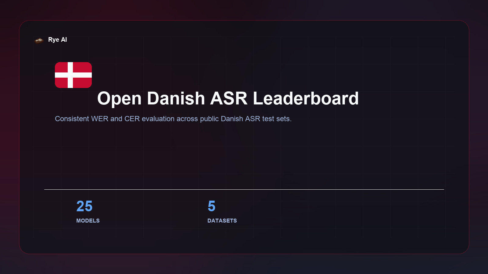

# Danish ASR Leaderboard



Reproducible benchmark and open leaderboard for **Danish automatic speech
recognition**, scored across five independent public test sets. Modelled on the
[HF Open ASR Leaderboard](https://github.com/huggingface/open_asr_leaderboard).

- **Leaderboard (Space):** https://huggingface.co/spaces/RyeAI/danish-asr-leaderboard
- **Results (dataset):** https://huggingface.co/datasets/RyeAI/danish-asr-leaderboard

One command evaluates a model on every test set, writes a result JSON, and the
push script publishes it to the leaderboard. The same harness covers local
models (transformers, NeMo, faster-whisper, …) and hosted APIs (ElevenLabs,
Azure OpenAI, Google Chirp, Soniox).

## Test sets

The leaderboard reports a per-dataset and a macro-averaged score over five
**core** test sets:

| Column | Dataset | Split | Domain |
|--------|---------|-------|--------|
| `coral_conversation` | [CoRal-project/coral-v3](https://huggingface.co/datasets/CoRal-project/coral-v3) — conversation | test | Spontaneous conversation |
| `coral_read_aloud` | [CoRal-project/coral-v3](https://huggingface.co/datasets/CoRal-project/coral-v3) — read_aloud | test | Read-aloud speech |
| `cv17_da` | [mozilla-foundation/common_voice_17_0](https://huggingface.co/datasets/mozilla-foundation/common_voice_17_0) — da | test | Crowd-sourced read speech |
| `fleurs_da` | [google/fleurs](https://huggingface.co/datasets/google/fleurs) — da_dk | test | Read speech |
| `ftspeech` | [alexandrainst/ftspeech](https://huggingface.co/datasets/alexandrainst/ftspeech) | test_balanced | Parliamentary / broadcast |

Two additional Alvenir subsets (`alvenir_oss`, `alvenir_wiki`) can be evaluated
but are **excluded** from the core means.

## Installation

System dependency (audio decoding):

```bash
apt install ffmpeg     # macOS: brew install ffmpeg
```

Core library:

```bash
pip install -e .
```

Then add the requirements for the backend(s) you want to run. Each file pulls
in `base.txt` plus that backend's framework, so you only install what you need:

```bash
pip install -r requirements/transformers.txt     # Whisper, Røst, hviske, …
pip install -r requirements/nemo.txt              # Canary / Parakeet / SALM
pip install -r requirements/faster_whisper.txt
pip install -r requirements/elevenlabs.txt        # API backend
# ... see requirements/ for the full list
```

> **NeMo note:** install `nemo_toolkit[asr]` *first* (before other packages) to
> avoid dependency-resolver conflicts. `uv pip install` is much faster than pip.

Log in for pushing results (read access is anonymous):

```bash
huggingface-cli login   # RyeAI org write token
```

## Running an evaluation

```bash
danish-asr-eval --model <model> --backend <backend> [options]
# equivalently: python run_eval.py --model ... --backend ...
```

Examples:

```bash
# Whisper / transformers (also Røst, hviske, and other seq2seq HF models)
danish-asr-eval --model openai/whisper-large-v3 --backend transformers

# NeMo Canary (HF or local .nemo)
danish-asr-eval --model nvidia/canary-1b-v2 --backend nemo --nemo-model-type canary
danish-asr-eval --model /path/to/best.nemo --model-id RyeAI/canary-1b-v2-da \
  --backend nemo --nemo-model-type canary --params-b 1.0

# NeMo Parakeet
danish-asr-eval --model nvidia/parakeet-tdt-0.6b-v3 --backend nemo --nemo-model-type parakeet

# Qwen3-ASR / fine-tunes
danish-asr-eval --model Qwen/Qwen3-ASR-1.7B --backend qwen-asr

# Voxtral
danish-asr-eval --model mistralai/Voxtral-Mini-3B-2507 --backend voxtral

# API backends (params not applicable → defaults to 0.0)
danish-asr-eval --model chirp_3 --backend google-chirp --google-cloud-project my-gcp-project
danish-asr-eval --model soniox-v1 --backend soniox --soniox-api-key "$SONIOX_API_KEY"

# Quick smoke test (cap samples per dataset)
danish-asr-eval --model openai/whisper-large-v3 --backend transformers --max-samples 100

# Subset of test sets
danish-asr-eval --model openai/whisper-large-v3 --backend transformers \
  --datasets cv17,fleurs
```

Run `danish-asr-eval --help` for all options (device, batch size, beam/KenLM,
per-API credentials, `--access open|proprietary`, …). Available backends:

`transformers`, `wav2vec2`, `faster-whisper`, `qwen-asr`, `nemo`, `nemo-salm`,
`voxtral`, `seamless`, `cohere-asr`, `vibevoice`, `elevenlabs`, `azure-openai`,
`google-chirp`, `soniox`.

Each run writes `results/<model-slug>.json` with per-dataset WER/CER, the core
means, speed, and metadata.

## Publishing to the leaderboard

```bash
python scripts/push_results.py
```

Pulls existing results from the HF dataset, merges your local JSONs (local wins
on conflict), rebuilds `data/results.parquet`, and uploads everything. Safe on a
fresh clone — nothing is lost.

To redeploy the static Space after editing `space/index.html`:

```bash
HF_TOKEN=hf_... python scripts/update_space.py
```

## Methodology

### Text normalisation
Applied identically to hypothesis and reference before scoring:

1. Unicode NFC
2. Danish number formatting — digit separators removed so that the same numeral
   scores identically regardless of formatting: thousand separators
   (`1.234` → `1234`) and decimal separators (`3,14` and `3.14` → `314`)
3. Lowercase
4. Strip punctuation (apostrophes inside words are kept)
5. Collapse whitespace

Broadly consistent with the Open ASR Leaderboard's `BasicTextNormalizer`, with
the addition of Danish digit handling. The guiding principle is **consistency**:
the exact same transform is applied to every model's hypothesis and to every
reference, so scores stay comparable across the board.

> Digit–word equivalence (`"4"` vs `"fire"`) is **not** normalised. A model that
> consistently emits one form when the reference uses the other will incur
> errors — a known limitation shared by most public ASR leaderboards.

> Danish orthographic variants (`aa`↔`å`, `oe`↔`ø`, `ae`↔`æ`) are **not**
> normalised either — the digraphs occur legitimately as letter sequences
> (`ekstraarbejde`, place names like `Aarhus`), so a blind substitution would
> introduce errors. Different Unicode encodings of the *same* letter **are**
> unified by NFC.

**Future improvement — digit↔word normalisation.** A robust fix would convert
between digits and number words on *both* the hypothesis and the reference at
scoring time (e.g. `"fire"` ↔ `"4"`), so models aren't penalised for a valid but
differently-formatted numeral. This needs a correct Danish number↔word converter
that handles years, ordinals, decimals, and phone numbers. The critical
requirement is symmetry: it must be applied identically to refs and hyps.
Applying it to only one side (e.g. normalising training transcripts but not the
eval references) silently inflates WER — see the VoxPopuli regression documented
on [RASMUS/Finnish-ASR-Canary-v2](https://huggingface.co/RASMUS/Finnish-ASR-Canary-v2),
where training-only number normalisation drove an apparent 4.5% → 13.9% WER jump
that was purely a normalisation artefact. Until such a converter is in place we
deliberately normalise neither side, which keeps the benchmark consistent.

### Metrics
Corpus-level **WER** and **CER** (%), lower is better, computed with `jiwer`:

```
WER = (substitutions + deletions + insertions) / reference_words   × 100
CER = (char sub + del + ins)                   / reference_chars   × 100
```

`mean_wer` / `mean_cer` are macro-averages across the five core test sets
(equally weighted). References that normalise to empty are dropped from scoring
to avoid divide-by-zero.

### Speed
`speed_x` = total audio duration / total inference time. 30x means 30 seconds of
audio per wall-clock second. Only the transcription call is timed (model load is
excluded). Hardware-dependent and network-bound for APIs — not directly
comparable across machines. There is **no warm-up run**: one-off costs (CUDA lazy
init, kernel autotuning) fall into the first batch, which slightly understates
throughput, more so on smaller test sets.

## Repository layout

```
danish_asr_leaderboard/
  cli.py            # argument parsing + evaluation driver
  datasets.py       # test-set loaders + registry
  normalizer/       # Danish text normalisation
  metrics.py        # WER / CER
  scoring.py        # transcribe + time a dataset
  results.py        # EvalResult, slug, params lookup, JSON writer
  audio.py          # ffmpeg transcode + duration helpers
  backends/         # one module per backend, self-registered via @register
    base.py         # Backend ABC + LoadOptions + registry
    api/            # hosted-API backends
run_eval.py         # thin CLI entry point
requirements/       # base.txt + one file per backend
scripts/            # push_results.py, update_space.py
space/              # Static HTML leaderboard (deployed to the HF Space)
results/            # generated result JSONs (git-ignored)
```

## Adding a backend

Create `danish_asr_leaderboard/backends/<name>_backend.py`, subclass `Backend`,
implement `transcribe_one` (and optionally `transcribe_batch`), and decorate the
loader with `@register("<name>")`. Import it from `backends/__init__.py` so it
registers on package import, add a `requirements/<name>.txt`, and it becomes a
valid `--backend` choice automatically.

## Contributing

Want your model on the leaderboard? Run the eval and open a PR with the result
JSON, or open a [discussion](https://huggingface.co/spaces/RyeAI/danish-asr-leaderboard/discussions)
on the Space. See [CONTRIBUTING.md](CONTRIBUTING.md).

## License

[MIT](LICENSE).
